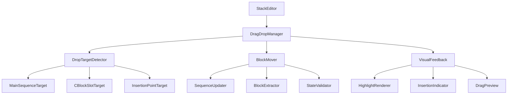

# Design Document

## Overview

This design addresses the advanced drag-and-drop functionality needed to complete the visual programming interface. The current implementation successfully handles basic palette-to-main-editor drops, but lacks support for complex scenarios involving C-block slots, inter-sequence moves, and advanced block management.

The design focuses on enhancing the existing `StackEditor` component and its drag-and-drop system to support all the advanced scenarios identified in the requirements, while maintaining backward compatibility with the current working functionality.

## Architecture

### Current System Analysis

The existing drag-and-drop system consists of:

1. **SequenceComponent**: Handles drops for block sequences
2. **BlockComponent**: Renders individual blocks and handles drag start
3. **PaletteBlock**: Handles palette block dragging
4. **Mock DataTransfer**: Test infrastructure for drag operations

**Current Limitations:**
- C-block slot drops are not properly handled in tests
- Block movement between sequences is incomplete
- Drop target detection is basic
- Multi-step operations lack proper state management

### Enhanced Architecture



## Components and Interfaces

### 1. Enhanced SequenceComponent

**Purpose**: Improve drop handling for all sequence types (main, C-block slots)

**Key Enhancements**:
- Better drop zone detection for C-block slots
- Insertion point calculation based on mouse position
- Support for nested sequence operations
- Improved visual feedback during drag operations

**Interface Changes**:
```typescript
interface SequenceComponentProps {
  blocks: StackBlock[];
  onSequenceChange?: (blocks: StackBlock[]) => void;
  onBlockMove?: (blockId: string) => void;
  registry?: StackRegistry;
  parentBlockId?: string;
  slotKey?: string;
  isNestedInCBlock?: boolean;
  // New props for enhanced functionality
  dragContext?: DragContext;
  onDropTargetChange?: (target: DropTarget | null) => void;
  insertionIndicatorPosition?: number | null;
}
```

### 2. DragContext System

**Purpose**: Maintain state and context during drag operations

```typescript
interface DragContext {
  isDragging: boolean;
  draggedBlock?: StackBlock;
  draggedBlockId?: string;
  dragType: 'palette-block' | 'existing-block';
  sourceSequence?: SequenceIdentifier;
  validTargets: DropTarget[];
  currentTarget?: DropTarget;
}

interface SequenceIdentifier {
  type: 'main' | 'c-block-slot';
  parentBlockId?: string;
  slotKey?: string;
}

interface DropTarget {
  sequenceId: SequenceIdentifier;
  insertionIndex: number;
  element: HTMLElement;
  isValid: boolean;
}
```

### 3. Enhanced BlockComponent

**Purpose**: Improve drag start handling and block movement

**Key Enhancements**:
- Better drag data preparation
- Source sequence identification
- Drag preview generation
- Cleanup on drag end

**Interface Changes**:
```typescript
interface BlockComponentProps {
  block: StackBlock;
  spec: StackBlockSpec;
  onBlockChange?: (updatedBlock: StackBlock) => void;
  onBlockMove?: (blockId: string) => void;
  registry?: StackRegistry;
  isDraggable?: boolean;
  // New props
  sequenceContext?: SequenceIdentifier;
  dragContext?: DragContext;
  onDragStart?: (context: DragStartContext) => void;
  onDragEnd?: () => void;
}

interface DragStartContext {
  block: StackBlock;
  sourceSequence: SequenceIdentifier;
  dragType: 'existing-block';
}
```

## Data Models

### 1. Enhanced Drag Data Structure

```typescript
interface PaletteDragData {
  type: 'palette-block';
  spec: StackBlockSpec;
  timestamp: number;
}

interface ExistingBlockDragData {
  type: 'existing-block';
  blockId: string;
  block: StackBlock;
  sourceSequence: SequenceIdentifier;
  timestamp: number;
}

type DragData = PaletteDragData | ExistingBlockDragData;
```

### 2. Drop Operation Result

```typescript
interface DropResult {
  success: boolean;
  operation: 'create' | 'move' | 'reorder';
  targetSequence: SequenceIdentifier;
  insertionIndex: number;
  blockId: string;
  error?: string;
}
```

### 3. Program State Changes

```typescript
interface ProgramStateChange {
  type: 'block-added' | 'block-moved' | 'block-reordered';
  blockId: string;
  sourceSequence?: SequenceIdentifier;
  targetSequence: SequenceIdentifier;
  insertionIndex: number;
  timestamp: number;
}
```

## Error Handling

### 1. Validation Layer

**Drop Validation**:
- Verify target sequence exists
- Check insertion index bounds
- Validate block compatibility with target
- Prevent circular references in nested blocks

**State Validation**:
- Ensure program consistency after operations
- Validate block references remain intact
- Check for orphaned blocks
- Verify sequence integrity

### 2. Error Recovery

**Failed Operations**:
- Restore previous program state
- Clear drag context
- Reset visual feedback
- Log error details for debugging

**Conflict Resolution**:
- Handle rapid successive operations
- Queue conflicting operations
- Provide user feedback for conflicts

## Testing Strategy

### 1. Unit Tests Enhancement

**SequenceComponent Tests**:
- C-block slot drop handling
- Insertion point calculation
- Multi-level nesting scenarios
- Error condition handling

**BlockComponent Tests**:
- Drag start data preparation
- Source sequence identification
- Drag end cleanup

**Integration Tests**:
- End-to-end drag operations
- Multi-step operation sequences
- Error recovery scenarios

### 2. Test Infrastructure Improvements

**Enhanced Mock DataTransfer**:
```typescript
interface EnhancedMockDataTransfer {
  data: Record<string, string>;
  setData(format: string, data: string): void;
  getData(format: string): string;
  clearData(): void;
  dropEffect: 'copy' | 'move' | 'link' | 'none';
  effectAllowed: 'copy' | 'move' | 'link' | 'copyMove' | 'copyLink' | 'linkMove' | 'all' | 'none';
  // Enhanced methods
  simulateMousePosition(x: number, y: number): void;
  simulateDropTarget(element: HTMLElement): void;
}
```

**Test Utilities**:
- Helper functions for creating complex program structures
- Utilities for simulating multi-step drag operations
- Assertion helpers for program state validation

### 3. Visual Testing

**Playwright Integration**:
- Test actual drag-and-drop in browser environment
- Verify visual feedback appears correctly
- Test complex multi-step scenarios
- Validate performance under load

## Implementation Phases

### Phase 1: Core Infrastructure
1. Enhance SequenceComponent drop handling
2. Implement DragContext system
3. Update BlockComponent drag start
4. Create enhanced test utilities

### Phase 2: C-Block Slot Support
1. Implement C-block slot drop detection
2. Add insertion point calculation
3. Create visual feedback for slots
4. Add comprehensive tests

### Phase 3: Inter-Sequence Movement
1. Implement block extraction from source
2. Add block insertion to target
3. Handle state updates correctly
4. Test complex movement scenarios

### Phase 4: Advanced Features
1. Multi-step operation support
2. Performance optimizations
3. Error recovery improvements
4. Visual feedback enhancements

### Phase 5: Integration and Polish
1. End-to-end testing
2. Performance validation
3. Bug fixes and refinements
4. Documentation updates

## Performance Considerations

### 1. Drag Operation Optimization
- Debounce drag over events
- Cache drop target calculations
- Minimize DOM queries during drag
- Use requestAnimationFrame for smooth updates

### 2. Memory Management
- Clean up event listeners on component unmount
- Clear drag context after operations
- Avoid memory leaks in nested components
- Optimize block rendering during drag

### 3. Large Program Handling
- Virtualize large block sequences
- Lazy load nested block content
- Optimize insertion point calculations
- Cache frequently accessed elements

## Security Considerations

### 1. Data Validation
- Validate all drag data before processing
- Sanitize block specifications from palette
- Prevent injection through block content
- Validate program structure integrity

### 2. Operation Limits
- Limit maximum nesting depth
- Prevent excessive block creation
- Rate limit drag operations
- Validate block relationships

This design provides a comprehensive foundation for implementing the advanced drag-and-drop functionality while maintaining the existing working features and ensuring robust error handling and testing.