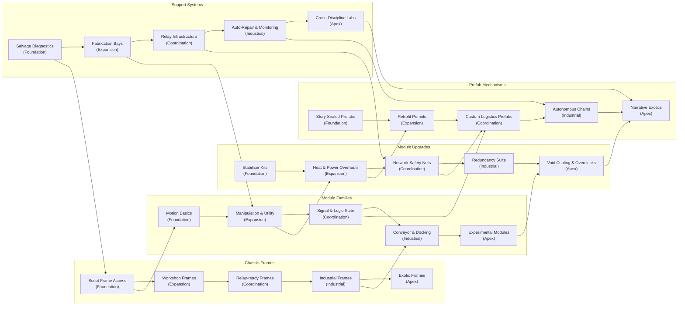

# Mechanism Module System Exploration

This document reframes the programmable robot concept around "mechanisms"—modular chassis units that gain capabilities through interchangeable modules. It expands the sandbox planning set so designers can evaluate how chaining mechanisms, sealed prefabs, and block programming intersect.

## Reset Context
- **Carry-over:** Modular attachments continue to define functional capabilities; existing chassis and inventory work remains relevant but adopts the mechanism terminology.
- **New Work:** Replace "robot" with "mechanism" as the core controllable entity, ensuring terminology, UI copy, and lore reflect the broader machine-building fantasy.
- **New Work:** Treat modules as hot-swappable capability packages (motor, actuator, logic, sensor, utility) that can be shared across bespoke and prefab mechanisms.
- **New Work:** Introduce sealed prefabricated mechanisms for early onboarding; players deploy them without inspecting internals until they unlock reverse-engineering tools.

## Terminology Alignment
- **Mechanism Chassis:** The base frame that supplies power budget, signal bandwidth, heat tolerance, and mounting points. In ECS terms it hosts the transform, state buffers, and slot schema described in the overlay spec.
- **Module:** A self-contained capability card that plugs into chassis slots. Modules expose a control interface to the block runtime (signals, telemetry, actions) and optional physical attachments (e.g., wheels, manipulators).
- **Rig:** A player-assembled mechanism configuration (chassis + modules + programme) saved as a reusable template card.
- **Prefab Mechanism:** A sealed rig delivered by the story or manufacturing pipeline. Players can deploy and programme it at a high level but cannot rearrange modules until they earn the right to strip it down.

## Module Families and Responsibilities
- **Motion Modules (Motor, Walker, Tread):** Supply locomotion actions and sensor data about traction, terrain clearance, and load. Attaching one upgrades a static chassis into a mobile mechanism.
- **Manipulation Modules (Grapple, Harvester, Printer):** Provide interaction verbs with the environment or other mechanisms, plus inventory access rules.
- **Signal Modules (Relay, Scrambler, Beacon):** Expand communication range, allow mechanism-to-mechanism messaging, or jam hostile signals. They determine network topology when chaining systems.
- **Logic/Automation Modules (Sequencer, Governor):** Offer built-in state machines or block-programming augmentations (e.g., local decision caches, safety interlocks) so multiple mechanisms can coordinate without central oversight.
- **Utility Modules (Power Core, Heat Sink, Shielding):** Adjust operating budgets, extend runtime, and mitigate environmental hazards. Prefabs often bake these in to maintain stability.

Each module publishes a schema to the block runtime describing:
1. Control signals it listens for (start, stop, vector input).
2. Telemetry values it exports (temperature, load, state flags).
3. Dependencies (requires motion module, expects shared bus, etc.).
4. Conflict rules (mutually exclusive slot occupancy, heat ceilings).

## Chaining Mechanisms into Production Lines
- Mechanisms can expose docking nodes as modules—e.g., a Conveyor module outputs packages to another mechanism’s Intake module.
- Signal modules broadcast status frames on shared channels so downstream mechanisms react without direct player intervention.
- Block programmes can subscribe to other mechanisms’ telemetry by referencing channel names, forming loose coupling rather than direct references.
- Energy and heat budgets cascade: upstream utility modules can reserve budget for downstream dependants, letting designers model bottlenecks.
- Failure isolation: if one mechanism overheats or jams, signal modules emit fault states so chained mechanisms pause gracefully instead of cascading failure.

## Prefabricated Mechanism Strategy
- Early missions seed sealed prefabs (Scout, Harvester, Stabiliser) with constrained interaction surfaces—players can assign programmes and inventory but cannot view module layout.
- Tutorials introduce modules through prefab breakdowns: once the player proves mastery, the narrative rewards a retrofit kit that unlocks individual modules from a prefab.
- Prefabs use lore-friendly wrappers (e.g., corporate warranty seals) explaining why internals are hidden; UI copy reflects this by greying out chassis slots with lock icons.
- Manufacturing tech tree tracks reverse-engineering progress. Unlocking a module family grants recipes for raw modules and the right to tear down certain prefab categories.

## Onboarding and Complexity Management
1. **Phase 1 — Guided Prefabs:** Player deploys sealed mechanisms with limited behavioural levers. Focus is on programme tweaks and logistics placement.
2. **Phase 2 — Partial Customisation:** Select slots become editable (e.g., swapping motion modules) while the rest remain sealed. Introduce risk/reward around warranty voiding.
3. **Phase 3 — Full Rig Assembly:** Player earns open chassis frames and can design mechanisms from scratch, chaining them into production networks.
4. **Phase 4 — Automation Ecosystem:** Mechanisms hand off tasks via signal buses and resource conveyors, enabling emergent factory-style setups.

Throughout these phases the block editor surfaces module-driven blocks (e.g., “When Motor Stall”, “If Conveyor Jammed”) so scripting power scales with mechanical understanding.

## Mechanism Technology Tree
The technology tree shapes how players earn, iterate on, and industrialise mechanisms without overwhelming early progression. It combines narrative research beats, manufacturing infrastructure, and salvage-driven discoveries.

### Progression Pillars
- **Chassis Frames:** Unlock tiers that expand slot counts, mounting strength, and base power budget. Early "Scout" frames limit modules to keep onboarding gentle, while later industrial frames enable parallel subsystems and additional automation buses.
- **Module Families:** Research nodes reveal baseline module blueprints for each family (Motion, Manipulation, Signal, Logic, Utility). Each unlock grants the right to fabricate the module, install it on open chassis, and integrate its control blocks.
- **Module Upgrades:** Subsequent tech nodes layer specialised variants (e.g., Terrain-Adaptive Motors, Precision Grapples, Shielded Relays) and overclock kits. Upgrades typically demand supporting utility techs to manage heat, power draw, or signal integrity.
- **Prefabricated Mechanisms:** Narrative contracts award sealed prefabs tied to specific research branches. Unlock milestones might expose a prefab category (e.g., Logistics Line) or grant retrofit permits for breaking warranty seals and harvesting their modules.
- **Support Systems:** Parallel tracks cover fabrication bays, diagnostics, and signal infrastructure. Without these, high-tier modules may be unusable or unstable.

### Unlock Structure
1. **Foundation Tier — Salvage & Tutorials:** Player recovers damaged prefabs, unlocking limited chassis frames and the most basic module family (Motion). Tech currency is scarce; progress flows through story-driven salvage tasks.
2. **Expansion Tier — Manufacturing Online:** Fabrication bay research introduces blueprint crafting. Manipulation and Utility modules become accessible, paired with upgrades that stabilise heat and power budgets.
3. **Coordination Tier — Networked Mechanisms:** Signal and Logic module families unlock, alongside relay infrastructure. Prefab retrofits become permissible, exposing sealed slots in select mechanisms and encouraging custom rig design.
4. **Industrial Tier — Automated Chains:** High-capacity chassis frames, conveyor/docking modules, and heavy-duty upgrades arrive. Support research covers redundancy (failsafe overrides, auto-repair drones) to keep production lines stable under load.
5. **Apex Tier — Exotic Systems:** Late-tree unlocks introduce experimental modules (quantum telemetry, void cooling) and narrative-critical prefabs. These demand cross-tree prerequisites, ensuring players understand interdependencies before use.

### Tech Currency and Prerequisites
- **Knowledge Cores:** Earned through story beats, analysis of salvaged prefabs, or completing research contracts. Required to unlock new families and chassis tiers.
- **Fabrication Capacity:** Upgrades to manufacturing bays determine how many modules can be built concurrently and gate higher-grade materials.
- **Calibration Trials:** High-tier upgrades require in-world trials (e.g., operate a chain without faults for a set duration) to reinforce mastery before deployment.
- **Cross-Discipline Links:** Some tech nodes require owning specific combinations (e.g., Logic Module Tier 2 demands Signal Tier 1 plus Diagnostics Support) to highlight systemic dependency.

### Player-Facing Presentation
- Tree UI groups nodes into columns (Chassis, Modules, Upgrades, Prefabs, Support) connected by prerequisite lines, mirroring the families defined earlier.
- Each node includes a lore snippet, practical benefit summary, and block-programming additions unlocked by the research.
- Prefab nodes display silhouette previews with lock icons until the associated retrofit permit is earned.
- Tooltips reference warranty states and safety requirements so players anticipate consequences (voided warranties, increased maintenance).

### Integration Hooks
- Update the programmable robot (mechanism) MVP backlog with research station UI tasks and data structures for storing tech unlock states.
- Ensure the ECS blackboard exposes `technology.unlockedModules` and similar facts so block programmes can check capabilities at runtime.
- Manufacturing simulations must respect tech gating when presenting build recipes or maintenance actions in the overlay.

## Implications for Existing Plans
- Update block runtime contracts so module capabilities map cleanly to signals and actions. The ECS blackboard must treat `selection.activeMechanismId` as the new anchor while maintaining compatibility with legacy robot terminology during the transition.
- Overlay and inventory specs should rename robots to mechanisms, clarifying slot terminology (e.g., "Mechanism Chassis" tab). Highlight locked slots on prefabs and provide hover text for sealed modules.
- Programmable Robot MVP tasks should be amended to include prefab authoring tools, module schema definitions, and mechanism-to-mechanism communication tests.
- Narrative beats in the steering documents should reference mechanism assembly tiers rather than robot counts, reinforcing the fantasy of constructing interlinked machines.

## Open Questions
- How do we visualise module connections on sealed prefabs without exposing internals? (e.g., silhouette overlays, status badges.)
- Should prefabs carry unique module variants that cannot be manufactured, creating aspirational upgrade paths?
- What failure modes demand manual intervention versus automatic recovery in chained mechanism networks?
- Do we require a separate permission system for cooperative play so different players manage specific mechanism clusters?
- How are rig templates versioned when modules receive balance tweaks—do existing deployments auto-migrate or require manual recompile?

Capturing answers to these questions will anchor the follow-up design passes and ensure implementation tasks align with the mechanism-first direction.
